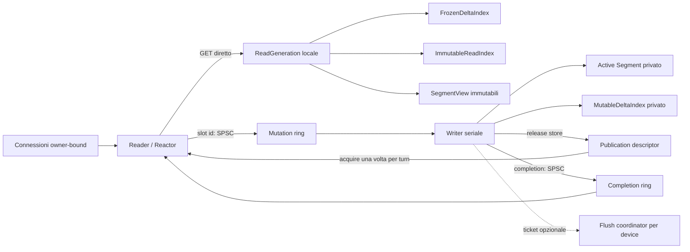
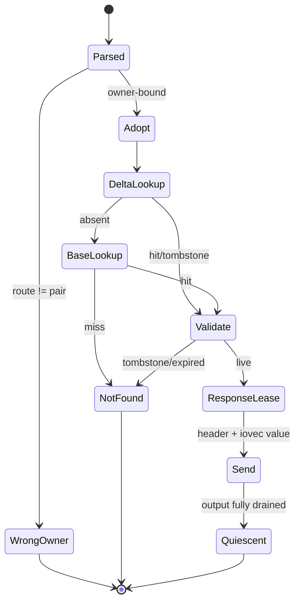
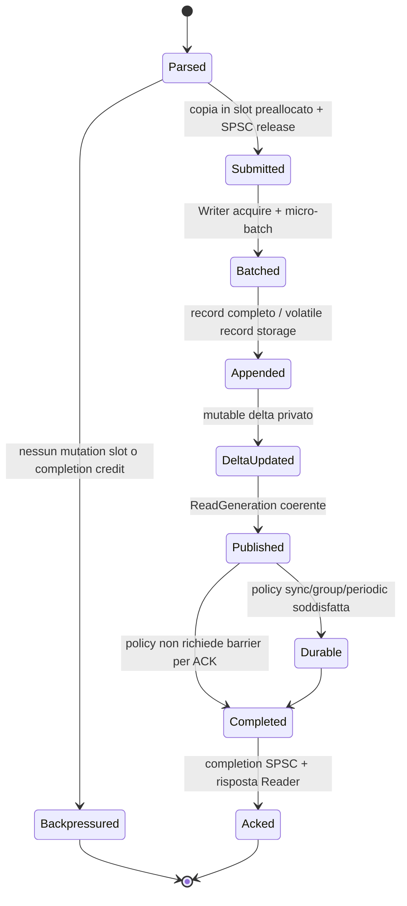

# ADR 0031: shard a coppie Reader–Writer

- Status: proposed
- Date: 2026-07-28
- Deciders: storage, networking, performance e reliability maintainers
- Applies to: nuovo runtime paired; persistence v1 e wire protocol v2 restano invariati
- Amends: ADR 0005, 0012, 0016, 0018, 0023 e 0030
- Supersedes: il modello Worker-affine corrente solo dopo il completamento dei gate di migrazione

## Contesto

Il daemon corrente combina un Reactor owner-affine con il data path di un Worker, ma GET e mutazioni
condividono ancora strutture mutabili e sincronizzazione nel `Store`. Le mutazioni durevoli escono dal
Reactor attraverso lane bounded MPSC e ritornano tramite code di completamento MPSC. Questo evita I/O
bloccante nel Reactor, ma non rende il GET indipendente dalla mutazione dello stesso shard e mantiene
task owning, mutex di admission e più produttori per lane.

La nuova unità di ownership è una coppia obbligatoria con un Reader/Reactor e un Writer seriale. Il
Reader deve leggere esclusivamente stato immutabile locale; il Writer deve essere l'unico mutatore.
La decisione è una migrazione del runtime, non una modifica dei byte persistenti.

## Driver della decisione

- GET owner-bound senza mutex, code, catalogo globale o Writer;
- un solo mutatore e due soli trasferimenti SPSC per coppia;
- p99/p99.9 GET stabili durante burst di scrittura, rotation e compaction;
- memoria, queueing, publication delay e reclamation rigorosamente bounded;
- routing seed, persistence v1, recovery fail-closed e classificazione degli esiti invariati;
- nessun refcount atomico, allocazione o ownership ambigua per GET;
- topologia misurabile su Linux NUMA, BSD/macOS e Apple Silicon.

## Decisione

Il runtime paired avrà esattamente `N` domini indipendenti:

```cpp
class ShardPair final {
  public:
    ReaderWorker reader;
    WriterWorker writer;
    ReadPublication publication;
    MutationQueue mutations;
    CompletionQueue completions;
};
```

Valgono sempre:

```text
reader_count == writer_count == shard_pair_count
pair_id == persisted owner_worker id
route = hash_key_routing(key, persisted_seed) % shard_pair_count
```

Non esistono reader o writer globali, lookup cross-pair, fallback su peer, migrazione online nel data
path o forwarding ripetuto. Il bind della connessione resta unico: il Reader della coppia è il suo
Reactor e unico proprietario del socket.

### Diagramma dell'architettura



### Ownership map

| Stato | Owner esclusivo | Accesso dell'altro lato |
|---|---|---|
| socket, parser, connection slot, output lease | Reader | nessuno |
| mutation slot libero/completato | Reader | Writer solo dopo dequeue e prima del completion |
| mutation slot submitted | Writer | Reader non lo tocca |
| active Segment, append cursor, sequence, batch | Writer | mai |
| `MutableDeltaIndex` | Writer | mai |
| `ReadGeneration` pubblicata | immutabile | Reader legge; Writer può solo ritirarla dopo quiescenza |
| `SegmentView` pubblicata | immutabile | Reader legge entro `visible_extent` |
| routing e pair topology | immutabile dopo startup | entrambi leggono |
| manifest/intent | persistence kernel | mai nel normale GET |

Il trasferimento di uno slot è lineare: `FreeReader → SubmittedWriter → CompletedReader → FreeReader`.
Nessun riferimento preso dallo slot può oltrepassare il successivo trasferimento di ownership.

## Percorso GET e state machine



Il Reader adotta al massimo una publication per event-loop turn, quindi ogni GET usa un solo
`ReadGeneration*` locale. Il lookup prova prima il delta e poi la base: massimo due lookup. TTL non
modifica l'Index sul GET; un record scaduto è semanticamente assente e il reclaim è lavoro Writer/
maintenance. Il normale GET non usa Writer, ring, thread pool, mutex, condition variable, manifest,
catalogo o allocatore condiviso.

Per valori inviati scatter/gather, il connection slot trattiene una lease Reader-locale dell'epoch
finché l'ultimo byte è stato scritto. Il Reader pubblica quiescenza solo oltre il minimo epoch ancora
referenziato dalle sue response lease. Non serve un incremento/decremento atomico per GET.

## Percorso PUT/ERASE e state machine



L'ACK non precede mai la publication contenente la mutazione. In modalità sync/group non precede
neppure il relativo durable boundary. Un disconnect dopo submission non cancella la mutazione; il
completion generationalmente stale viene scartato e il client conserva un esito indeterminato.

### Frontiere `accepted`, `visible` e `durable`

| Frontiera | Significato | Avanzamento |
|---|---|---|
| `accepted_through` | mutation slot trasferito al Writer | dequeue SPSC in ordine |
| `visible_through` | inclusa nella publication corrente | release-store del descriptor |
| `durable_through` | inclusa nel boundary persistente completato | commit/flush v1 riuscito |

`durable_through <= visible_through <= accepted_through`. I contatori sono sequenze Writer-locali,
monotone e non sono usati come sostituti del descriptor di publication.

Ordine per policy:

| Modalità | Ordine prima dell'ACK |
|---|---|
| volatile | append completo → delta → publication → completion |
| durable-periodic | append/slot secondo contratto periodic → publication → completion; durability può seguire |
| durable-sync | append → sync record → commit slot → sync → publication → completion |
| durable-group | append batch → barrier/commit batch → publication batch → completions |

La prima implementazione privilegia commit-before-publication per sync/group, riusando il contratto
v1. Una futura publication-before-durability è ammessa solo per policy che già consente ACK non
durevole e con recovery che tratta la generation come stato derivato, mai come autorità persistente.

## Code e backpressure

Ogni coppia ha esattamente una mutation ring e una completion ring SPSC. Capacità power-of-two,
storage preallocato, indici producer/consumer su linee da 128 byte e payload triviale/compattamente
movibile. Le ring trasportano identificatori di slot, non `std::string`, `std::vector`, callback,
`RecordRef`, file handle o smart pointer.

Il Reader possiede un pool fisso di mutation slot con aree key/value bounded. Prima del submit
riserva insieme slot, byte budget e un completion credit. Perciò ogni mutazione accettata ha già
spazio garantito nel completion ring. Una completion full non è overload ordinario: viola un
invariante e rende la coppia fail-closed; non può causare drop o spin illimitato.

Quando manca capacità il Reader disarma temporaneamente l'interesse read del socket interessato o
applica admission control. Il profilo può scegliere reject immediato o bounded spin misurato, ma il
default è backpressure del socket; `park` è ammesso solo fuori dal Reactor. Nessuna ring cresce.

Memory ordering minimo:

- producer scrive completamente cella/slot, poi pubblica `head` con release;
- consumer osserva `head` con acquire prima di leggere;
- consumer termina l'uso, poi pubblica `tail` con release;
- producer osserva `tail` con acquire prima del riuso;
- indici locali e metriche non pubblicanti usano relaxed.

## Index a due livelli

`ImmutableReadIndex` è compatto, senza tombstone di costruzione, resize o metadati di scrittura.
`FrozenDeltaIndex` contiene l'override più recente o un tombstone. Il Writer mantiene un
`MutableDeltaIndex` privato.

Non viene creata una catena di delta. Durante un merge incrementale:

1. la generation leggibile resta `Base B + Frozen Dcut`;
2. il Writer costruisce a quanta `B' = merge(B, Dcut)`;
3. le nuove scritture si accumulano in un delta post-cut privato;
4. finché `B'` non è pronto, una publication usa un nuovo delta cumulativo bounded rispetto a `B`;
5. verificato `B'`, il Writer pubblica `B' + Frozen Dpost` in un solo descriptor.

Soglie hard su entry e byte impediscono crescita non limitata. Se il merge non mantiene il passo,
la coppia applica backpressure alle scritture; non aggiunge un terzo livello.

## Protocollo di publication

Non si usano due atomiche indipendenti `epoch` e `generation`. Il Writer costruisce un descriptor
immutabile:

```cpp
struct PublicationDescriptor final {
    const ReadGeneration* generation;
    std::uint64_t epoch;
    std::uint64_t visible_through;
};

std::atomic<const PublicationDescriptor*> current;
```

Il Writer inizializza generation, index, segment view e descriptor, poi esegue un unico
`current.store(next, std::memory_order_release)`. Il Reader esegue una volta per turn
`current.load(std::memory_order_acquire)` e adotta pointer ed epoch dallo stesso oggetto. Non è
possibile osservare epoch nuovo e generation vecchia. `PublicationDescriptor` e tutto il grafo
raggiungibile sono immutabili dopo lo store.

## Protocollo di reclamation

Il prototipo confinato implementa già QSBR a due thread con un pool bounded di descriptor stabili;
la versione production estende lo stesso principio alle response lease:

1. Writer pubblica epoch `N` e accoda il vecchio descriptor nella retire list bounded;
2. Reader termina il turn e ogni zero-copy lease dell'epoch precedente;
3. Reader incrementa il turn quiescente prima dell'acquire del nuovo descriptor;
4. Writer conserva la generation ritirata per almeno due confini successivi e la libera soltanto
   quando il contatore osservato raggiunge `retire_after_turn`;
5. shutdown forza drain delle response lease prima dell'ultima quiescenza.

Il Reader non pubblica quiescenza mentre un iovec, `RecordRef`, Index slot o SegmentView della
generation è ancora usato. Il prototipo dichiara pertanto gli span validi fino al turn successivo;
il Reactor production dovrà includere le output lease nel minimo epoch. Retire-list full applica
publication/write backpressure; non forza free.

## Segment e compaction

L'active Segment e i suoi metadati sono Writer-private. Una publication espone `SegmentView`
immutabili con identità, generation pin e `visible_extent`; byte sotto tale extent sono completi e
non vengono più modificati. Rotation pubblica una nuova view senza invalidare la precedente.

Compaction costruisce e verifica una generation successiva a copy quanta. Il Reader continua su G;
G+1 viene pubblicata atomicamente e G viene ritirata solo dopo QSBR. Intent e Manifest restano le
sole autorità crash-safe. Copy, checksum e file I/O non avvengono nel Reader e non bloccano la
publication corrente. Reclaim debt, rate limit, capacity bypass e p99 guard restano per coppia.

## Micro-batching Writer

Ogni Writer chiude il batch sulla prima fra: record count, byte count, deadline, durability boundary,
queue pressure e publication urgency. Con coda vuota non introduce un'attesa artificiale. I profili
configurano solo soglie, affinity e budget; non cambiano ordering, visibility o failure semantics.

## Topologia e profili

Reader e Writer usano core fisici distinti ma vicini, preferibilmente nello stesso NUMA node/LLC.
Sibling SMT è una variante benchmark, non il default maximum-performance. Linux usa affinity sul
cpuset consentito e allocazione first-touch; macOS usa affinity tag/QoS e dichiara il risultato
advisory. Apple Silicon preferisce P-core quando l'API disponibile lo consente senza promessa falsa
di hard pinning.

Profili iniziali: `balanced`, `read_optimized`, `write_optimized`, `maximum_performance` e
`memory_constrained`. Ogni profilo produce una configurazione effettiva osservabile.

## Shutdown protocol

```text
stop listener e nuova admission
→ Reader disarma socket read per nuove mutation
→ drain mutation ring
→ Writer chiude batch e classifica ogni mutazione
→ commit/flush richiesti
→ pubblica l'ultima ReadGeneration necessaria
→ drain completion ring
→ Reader invia ACK già ammessi o chiude con esito esplicito alla deadline
→ drain output lease e pubblica quiescenza
→ Writer ritira generation sicure
→ chiude Segment, connessioni e runtime
```

Mutation slot accettati non vengono persi. Scadenza del drain può rifiutare solo slot non ancora
trasferiti al Writer; dopo dequeue l'operazione deve completare con `committed`, `not_committed` o
`indeterminate`.

## Failure matrix

| Failure | Azione | Esito client / stato |
|---|---|---|
| mutation queue full | socket backpressure o reject policy | `overloaded`, non accettata |
| completion credit assente | non submit | `overloaded`, non accettata |
| completion ring full con credit | fail-close pair/process | invariant violation; mai drop |
| allocation prima del submit | nessun transfer | `resource_exhausted`, not committed |
| append/rotation prima del commit | non pubblicare batch | not committed se provato, altrimenti indeterminate |
| commit EIO/ENOSPC | non ACK success; fail-close se autorità incerta | classificazione v1 invariata |
| crash append→publication | recovery usa solo Manifest/commit v1 | generation RAM ignorata |
| crash publication→periodic durability | visibilità persa al restart ammessa dalla policy | ACK secondo periodic |
| publication build failure | generation corrente resta autorevole | batch non ACK; retry solo pre-commit |
| Writer termina inatteso | pair unavailable, stop admission | nessun silent loss |
| Reader termina inatteso | Writer drena/classifica slot accettati | socket outcome indeterminate se già accettato |
| shutdown durante batch | chiusura anticipata del batch | normale classificazione |
| retire backlog pieno | sospende nuove publication/mutation | bounded backpressure |
| generation incompleta su recovery | non è autorità persistente | ignorata; recovery fail-closed sui soli byte v1 |

## Osservabilità

Ogni snapshot per coppia include almeno: pair/CPU id, reader/writer operations, GET hit/miss,
reader/writer epoch, accepted/visible/durable through, base/delta entry, publication count/record/
byte/latency, profondità/high-water/full delle due ring, batch size/wait, stall Reader/Writer,
generation retire count/delay e response-lease epoch minimo. Le metriche non pubblicano correttezza e
usano relaxed o snapshot owner-local.

## Benchmark plan e criteri di accettazione

Il confronto A/B usa stessa revisione dati, routing seed, hardware, build e client, con esecuzioni
old/new interleaved. Matrice minima:

- mix GET/PUT: 100/0, 99/1, 95/5, 90/10;
- working set: L2, LLC, oltre LLC; uniform, Zipf e hot key;
- value: 64 B, 1 KiB, 64 KiB, 256 KiB;
- pipeline: 1, 8, 32, 128; una e più connessioni per coppia;
- write: volatile/sync/group/periodic; batch 1, 4, 16, 32, 128; queue saturation;
- overlap: burst, read-after-write, rotation, incremental compaction;
- scale: 1, 2, 4, 8 coppie entro i core fisici, senza oversubscription nella baseline.

Si registrano throughput, p50/p95/p99/p99.9, queue/publication/commit delay, CPU, IPC, branch/cache/
LLC/dTLB miss, context switch, migration, syscall, copie, allocazioni, RSS, generation e reclaim delay.
Linux usa `perf stat/record`; macOS Instruments e `powermetrics` quando autorizzato. I raw result
vanno in `benchmark-results/paired-shards/<commit>/<platform>/`.

Gate obbligatori: GET owner-bound dimostrato senza mutex/coda; migliore p99 sotto write concorrenti;
scalabilità con le coppie; read-after-write; bounded memory/queue; sanitizer, fuzz, fault e crash test;
nessuna perdita in shutdown. Il solo throughput medio non chiude il gate.

## Piano di migrazione e backlog

1. **Design:** questa ADR, memory model paired, state/failure machine e harness A/B.
2. **Prototipo volatile confinato:** una coppia non collegata al daemon, ring SPSC, slot pool,
   generation immutabile e test read-after-write/backpressure.
3. **Multi-pair:** routing persistito, Reactor ownership, affinity, metriche e scaling.
4. **Durabilità:** Segment v1, sync/group/periodic, rotation e fault classification.
5. **Compaction/reclamation:** QSBR, retirement, merge incrementale e Manifest transition.
6. **Reader optimization:** `ImmutableReadIndex`, SIMD, scatter/gather, get-into, batch lookup e PGO.

Il runtime corrente resta il default fino a quando la fase corrispondente supera A/B e correctness
gate. Non esiste una modalità ibrida in cui una stessa chiave sia servita da entrambi i runtime.
L'attivazione richiede una config/versione runtime esplicita; il rollback riapre gli stessi byte v1
con il runtime precedente. Cambiare pair count resta migrazione offline (ADR 0024).

## Alternative considerate

- Reader pool globale: rifiutato per routing, queue e cache-line sharing.
- Più Reader per Writer: rinviato; complica publication, reclamation e connection ownership.
- Index concorrente unico: rifiutato perché mantiene sincronizzazione e layout di scrittura sul GET.
- RCU generico/shared_ptr per GET: rifiutato per refcount atomico per richiesta.
- Catena di delta: rifiutata; lookup e reclamation non sarebbero bounded a due livelli.
- Writer sul Reactor: rifiutato perché I/O e batching ricreano head-of-line blocking.

## Conseguenze

Il modello raddoppia i thread storage per shard e richiede più memoria per generazioni/delta durante
merge. In cambio separa completamente GET e mutazioni, rende il Writer seriale per costruzione e
riduce la sincronizzazione a publication e due SPSC. Hardware con pochi core potrà preferire
`memory_constrained`, ma non è ammesso fondere Reader e Writer violando l'invariante della coppia.

## Compatibilità

Nessuna modifica a Manifest, Segment header, Record v1, routing seed o wire v2. `worker_count` diventa
semanticamente `shard_pair_count` mantenendo gli owner id persistiti. Configurazioni con conteggi
Reader/Writer differenti sono rifiutate prima del listen. API e statistiche nuove saranno aggiunte
in modo additive finché il runtime paired non sostituirà quello corrente.

## Verifica

Ogni fase richiede test deterministici di ordering release/acquire, wraparound ring, credit invariant,
slot lifetime, publication atomica, massimo due lookup, read-after-write, disconnect/shutdown,
generation retirement e fault matrix. TSAN/ASan/UBSan, allocation fault, fuzz e crash suite restano
gate. Litmus test e stress non sostituiscono la prova di ownership documentata.

## Riferimenti

- [Concurrency and memory model](../spec/concurrency-memory-model.md)
- [Benchmark standard](../spec/benchmark-standard.md)
- [ADR 0012](0012-worker-affine-reactors.md)
- [ADR 0018](0018-bounded-durable-mutation-lanes.md)
- [ADR 0030](0030-keyed-worker-routing.md)
- [Persistence v1](../spec/persistence-v1.md)
