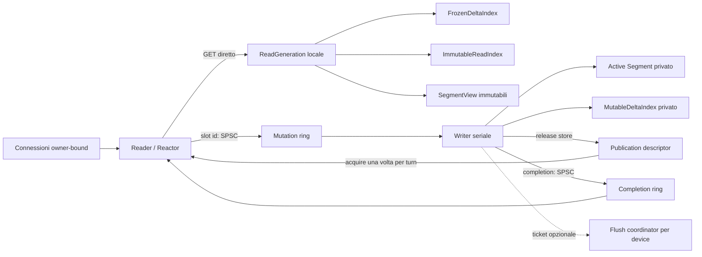
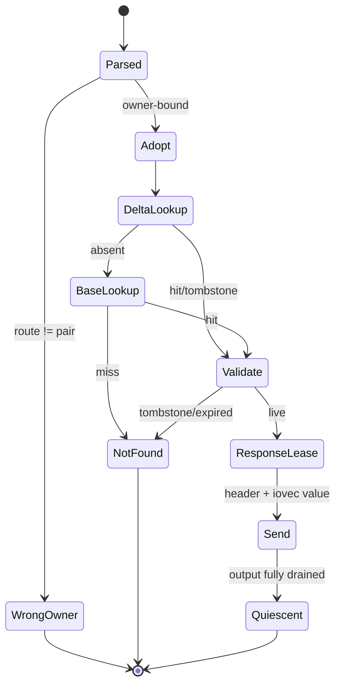
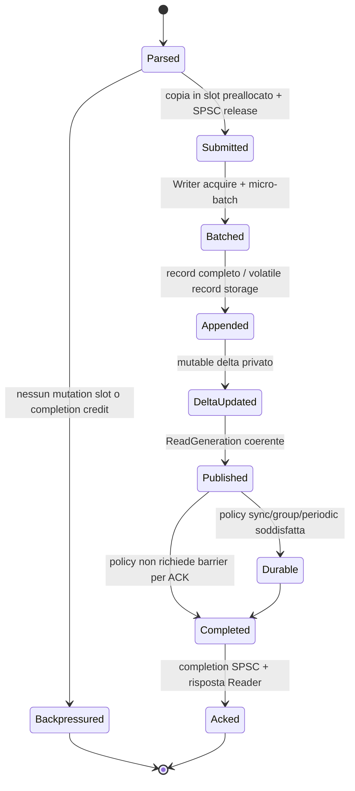

# ADR 0031: shard a coppie Reader–Writer

- Status: accepted (product concurrency for `glyphastored`; amended for embedded Store by 0032)
- Date: 2026-07-28
- Deciders: project owner, storage, networking, performance e reliability maintainers
- Applies to: runtime paired; persistence v1 e wire protocol v2 restano invariati
- Amends: ADR 0005, 0012, 0016, 0018, 0023 e 0030
- Amended by: [ADR 0032](0032-paired-concurrency-embedded-store.md) (paired concurrency becomes the
  default for embedded `Store` as well as the daemon; supersedes Worker-mutex as product default)
- Supersedes: il modello Worker-affine / mutex sull’Index come default di prodotto (completato con
  ADR 0032); non supersede persistence v1 né wire v2

## Contesto

Il daemon corrente combina un Reactor owner-affine con il data path di un Worker, ma GET e mutazioni
condividono ancora strutture mutabili e sincronizzazione nel `Store`. Le mutazioni durevoli escono dal
Reactor attraverso lane bounded MPSC e ritornano tramite code di completamento MPSC. Questo evita I/O
bloccante nel Reactor, ma non rende il GET indipendente dalla mutazione dello stesso shard e mantiene
task owning, mutex di admission e più produttori per lane.

La nuova unità di ownership è una coppia obbligatoria con un Reader/Reactor e un Writer seriale. Il
Reader deve leggere esclusivamente stato immutabile locale; il Writer deve essere l'unico mutatore.
La decisione è una migrazione del runtime, non una modifica dei byte persistenti.

## Driver della decisione

- GET owner-bound senza mutex, code, catalogo globale o Writer;
- un solo mutatore e due soli trasferimenti SPSC per coppia;
- p99/p99.9 GET stabili durante burst di scrittura, rotation e compaction;
- memoria, queueing, publication delay e reclamation rigorosamente bounded;
- routing seed, persistence v1, recovery fail-closed e classificazione degli esiti invariati;
- nessun refcount atomico, allocazione o ownership ambigua per GET;
- topologia misurabile su Linux NUMA, BSD/macOS e Apple Silicon.

## Decisione

Il runtime paired avrà esattamente `N` domini indipendenti:

```cpp
class ShardPair final {
  public:
    ReaderWorker reader;
    WriterWorker writer;
    ReadPublication publication;
    MutationQueue mutations;
    CompletionQueue completions;
};
```

Valgono sempre:

```text
reader_count == writer_count == shard_pair_count
pair_id == persisted owner_worker id
route = hash_key_routing(key, persisted_seed) % shard_pair_count
```

Non esistono reader o writer globali, lookup cross-pair, fallback su peer, migrazione online nel data
path o forwarding ripetuto. Il bind della connessione resta unico: il Reader della coppia è il suo
Reactor e unico proprietario del socket.

### Diagramma dell'architettura



### Ownership map

| Stato | Owner esclusivo | Accesso dell'altro lato |
|---|---|---|
| socket, parser, connection slot, output lease | Reader | nessuno |
| mutation slot libero/completato | Reader | Writer solo dopo dequeue e prima del completion |
| mutation slot submitted | Writer | Reader non lo tocca |
| active Segment, append cursor, sequence, batch | Writer | mai |
| `MutableDeltaIndex` | Writer | mai |
| `ReadGeneration` pubblicata | immutabile | Reader legge; Writer può solo ritirarla dopo quiescenza |
| `SegmentView` pubblicata | immutabile | Reader legge entro `visible_extent` |
| routing e pair topology | immutabile dopo startup | entrambi leggono |
| manifest/intent | persistence kernel | mai nel normale GET |

Il trasferimento di uno slot è lineare: `FreeReader → SubmittedWriter → CompletedReader → FreeReader`.
Nessun riferimento preso dallo slot può oltrepassare il successivo trasferimento di ownership.

## Percorso GET e state machine



Il Reader adotta al massimo una publication per event-loop turn, quindi ogni GET usa un solo
`ReadGeneration*` locale. Il lookup prova prima il delta e poi la base: massimo due lookup. TTL non
modifica l'Index sul GET; un record scaduto è semanticamente assente e il reclaim è lavoro Writer/
maintenance. Il normale GET non usa Writer, ring, thread pool, mutex, condition variable, manifest,
catalogo o allocatore condiviso.

Per valori inviati scatter/gather, il connection slot trattiene una lease Reader-locale dell'epoch
finché l'ultimo byte è stato scritto. Il Reader pubblica quiescenza solo oltre il minimo epoch ancora
referenziato dalle sue response lease. Non serve un incremento/decremento atomico per GET.

## Percorso PUT/ERASE e state machine



L'ACK non precede mai la publication contenente la mutazione. In modalità sync/group non precede
neppure il relativo durable boundary. Un disconnect dopo submission non cancella la mutazione; il
completion generationalmente stale viene scartato e il client conserva un esito indeterminato.

### Frontiere `accepted`, `visible` e `durable`

| Frontiera | Significato | Avanzamento |
|---|---|---|
| `accepted_through` | mutation slot trasferito al Writer | dequeue SPSC in ordine |
| `visible_through` | inclusa nella publication corrente | release-store del descriptor |
| `durable_through` | inclusa nel boundary persistente completato | commit/flush v1 riuscito |

`durable_through <= visible_through <= accepted_through`. I contatori sono sequenze Writer-locali,
monotone e non sono usati come sostituti del descriptor di publication.

Ordine per policy:

| Modalità | Ordine prima dell'ACK |
|---|---|
| volatile | append completo → delta → publication → completion |
| durable-periodic | append/slot secondo contratto periodic → publication → completion; durability può seguire |
| durable-sync | append → sync record → commit slot → sync → publication → completion |
| durable-group | append batch → barrier/commit batch → publication batch → completions |

La prima implementazione privilegia commit-before-publication per sync/group, riusando il contratto
v1. Una futura publication-before-durability è ammessa solo per policy che già consente ACK non
durevole e con recovery che tratta la generation come stato derivato, mai come autorità persistente.

## Code e backpressure

Ogni coppia ha esattamente una mutation ring e una completion ring SPSC. Capacità power-of-two,
storage preallocato, indici producer/consumer su linee da 128 byte e payload triviale/compattamente
movibile. Le ring trasportano identificatori di slot, non `std::string`, `std::vector`, callback,
`RecordRef`, file handle o smart pointer.

Il Reader possiede un pool fisso di mutation slot con aree key/value bounded. Prima del submit
riserva insieme slot, byte budget e un completion credit. Perciò ogni mutazione accettata ha già
spazio garantito nel completion ring. Una completion full non è overload ordinario: viola un
invariante e rende la coppia fail-closed; non può causare drop o spin illimitato.

Quando manca capacità il Reader disarma temporaneamente l'interesse read del socket interessato o
applica admission control. Il profilo può scegliere reject immediato o bounded spin misurato, ma il
default è backpressure del socket; `park` è ammesso solo fuori dal Reactor. Nessuna ring cresce.

Memory ordering minimo:

- producer scrive completamente cella/slot, poi pubblica `head` con release;
- consumer osserva `head` con acquire prima di leggere;
- consumer termina l'uso, poi pubblica `tail` con release;
- producer osserva `tail` con acquire prima del riuso;
- indici locali e metriche non pubblicanti usano relaxed.

## Index a due livelli

`ImmutableReadIndex` non contiene tombstone di costruzione, resize o metadati di scrittura. Il Base
usa record compatti da massimo 64 B, chiavi inline fino a 16 B, arena per chiavi lunghe e pin di
Segment generation deduplicati; i control byte restano contigui per ogni gruppo SIMD. Il delta
frozen paginato contiene l'override più recente o un tombstone ed è modificato solo mediante builder
Writer-owned copy-on-write. Le pagine conservano puntatori a celle immutabili da 64 B allocate in
blocchi append-only Writer-owned; chiavi lunghe e pin di Segment/file generation hanno indirizzo
stabile nell'arena. Non esiste più un control block `shared_ptr` per versione.

Non viene creata una catena di delta. Durante un merge incrementale:

1. la generation leggibile resta `Base B + Frozen Dcut`;
2. il Writer costruisce a quanta `B' = merge(B, Dcut)`;
3. le nuove scritture si accumulano in un delta post-cut privato;
4. finché `B'` non è pronto, una publication usa un nuovo delta cumulativo bounded rispetto a `B`;
5. verificato `B'`, il Writer pubblica `B' + Frozen Dpost` in un solo descriptor.

Soglie hard su entry, versioni e byte impediscono crescita non limitata. Il merge parte anche quando
overwrite ripetuti raggiungono la soglia delle versioni pur lasciando una sola chiave logica. Se il merge non mantiene il passo,
la coppia applica backpressure alle scritture; non aggiunge un terzo livello.

La configurazione production iniziale avvia il merge a 8.192 entry, limita il post-cut a 32.736
entry, limita il delta complessivo a 40.960 entry e processa 4.096 slot per turn del Writer. Il
quantum conta anche gli slot vuoti, quindi il lavoro di ogni invocazione è bounded. La base nuova
alloca le pagine soltanto mentre vengono visitati record vivi; la directory iniziale è proporzionale
a una voce ogni 65.536 slot. Ogni mutazione post-cut viene inserita sia nel delta cumulativo ancora
visibile rispetto a `B`, sia in `Dpost`. La verifica di capacità avviene prima della mutazione Store:
esaurimento del delta o retire pressure producono backpressure, mai una mutazione non pubblicabile.
Un refresh durevole da rotation/compaction sostituisce atomicamente lo snapshot e annulla il merge
in corso; il cut resta pinning-safe fino alla distruzione dello stato Writer-private.

## Protocollo di publication

Non si usano due atomiche indipendenti `epoch` e `generation`. `epoch` e `visible_through` sono campi
della stessa generation immutabile pubblicata dal Writer:

```cpp
struct ReadGeneration final {
    std::uint64_t epoch;
    std::uint64_t visible_through;
    // Base, delta e pin immutabili.
};

std::atomic<const ReadGeneration*> current;
```

Il Writer inizializza generation, index, segment view e descriptor, poi esegue un unico
`current.store(next, std::memory_order_release)`. Il Reader esegue una volta per turn
`current.load(std::memory_order_acquire)` e adotta pointer ed epoch dallo stesso oggetto. Non è
possibile osservare epoch nuovo e generation vecchia. La generation e tutto il grafo raggiungibile
sono immutabili dopo lo store.

## Protocollo di reclamation

Il runtime production usa una frontiera QSBR di epoch unica e conservativa:

1. Writer pubblica epoch `N` e accoda il vecchio descriptor nella retire list bounded;
2. Reader adotta `N` una volta per turn e registra ogni cold I/O asincrono con il proprio epoch;
3. Reader pubblica `min(epoch adottato, epoch minimo delle lease)` come `reader_safe_epoch`;
4. Writer libera soltanto descriptor con `retired_epoch < reader_safe_epoch`;
5. la completion cold contiene già un valore owning, quindi il Reader può rilasciare la lease I/O
   prima di accodare la risposta;
6. shutdown forza il drain delle lease prima dell'arresto di Writer e Store.

Il tracker Reader-private ha 65 celle preallocate: la retire list è limitata a 64 generation più la
corrente. Un task cold prende in prestito key storage, `RecordRef` e file-generation pointer dalla
generation soltanto dopo aver stabilito questa frontiera; non esegue refcount atomici per richiesta.
Una connessione chiusa cancella l'I/O ma non rilascia anticipatamente la lease. Retire-list o tracker
full applicano backpressure e non forzano mai il free.

La risposta scatter corrente possiede un `OwnedValue` e non conserva `Index` slot, `RecordRef` o
Segment pin: può quindi rilasciare la lease QSBR del task prima del drain socket. Un futuro `get-into`
che esponesse iovec borrowed dalla generation dovrebbe invece estendere la stessa frontiera fino
alla short write finale; non potrà pubblicare quiescenza mentre quei riferimenti sono vivi.

## Segment e compaction

L'active Segment e i suoi metadati sono Writer-private. Una publication espone `SegmentView`
immutabili con identità, generation pin e `visible_extent`; byte sotto tale extent sono completi e
non vengono più modificati. Rotation pubblica una nuova view senza invalidare la precedente.

Compaction costruisce e verifica una generation successiva a copy quanta. Il Reader continua su G;
G+1 viene pubblicata atomicamente e G viene ritirata solo dopo QSBR. Intent e Manifest restano le
sole autorità crash-safe. Copy, checksum e file I/O non avvengono nel Reader e non bloccano la
publication corrente. Reclaim debt, rate limit, capacity bypass e p99 guard restano per coppia.

## Micro-batching Writer

Ogni Writer chiude il batch sulla prima fra: record count, byte count, deadline, durability boundary,
queue pressure e publication urgency. Con coda vuota non introduce un'attesa artificiale. I profili
configurano solo soglie, affinity e budget; non cambiano ordering, visibility o failure semantics.

## Topologia e profili

Reader e Writer usano core fisici distinti ma vicini, preferibilmente nello stesso NUMA node/LLC.
Sibling SMT è una variante benchmark, non il default maximum-performance. Linux usa affinity sul
cpuset consentito e allocazione first-touch; macOS usa affinity tag/QoS e dichiara il risultato
advisory. Apple Silicon preferisce P-core quando l'API disponibile lo consente senza promessa falsa
di hard pinning.

Profili iniziali: `balanced`, `read_optimized`, `write_optimized`, `maximum_performance` e
`memory_constrained`. Ogni profilo produce una configurazione effettiva osservabile.

## Shutdown protocol

```text
stop listener e nuova admission
→ Reader disarma socket read per nuove mutation
→ drain mutation ring
→ Writer chiude batch e classifica ogni mutazione
→ commit/flush richiesti
→ pubblica l'ultima ReadGeneration necessaria
→ drain completion ring
→ Reader invia ACK già ammessi o chiude con esito esplicito alla deadline
→ drain output lease e pubblica quiescenza
→ Writer ritira generation sicure
→ chiude Segment, connessioni e runtime
```

Mutation slot accettati non vengono persi. Scadenza del drain può rifiutare solo slot non ancora
trasferiti al Writer; dopo dequeue l'operazione deve completare con `committed`, `not_committed` o
`indeterminate`.

## Failure matrix

| Failure | Azione | Esito client / stato |
|---|---|---|
| mutation queue full | socket backpressure o reject policy | `overloaded`, non accettata |
| completion credit assente | non submit | `overloaded`, non accettata |
| completion ring full con credit | fail-close pair/process | invariant violation; mai drop |
| allocation prima del submit | nessun transfer | `resource_exhausted`, not committed |
| append/rotation prima del commit | non pubblicare batch | not committed se provato, altrimenti indeterminate |
| commit EIO/ENOSPC | non ACK success; fail-close se autorità incerta | classificazione v1 invariata |
| crash append→publication | recovery usa solo Manifest/commit v1 | generation RAM ignorata |
| crash publication→periodic durability | visibilità persa al restart ammessa dalla policy | ACK secondo periodic |
| publication build failure prima della mutazione | generation corrente resta autorevole | batch non accettato |
| publication build failure dopo commit/mutazione | fail-close sticky | nessun ACK di successo; esito client indeterminato |
| merge quantum allocation failure | annulla il builder, conserva `B + D` | retry bounded dopo progresso o backpressure |
| Writer termina inatteso | pair unavailable, stop admission | nessun silent loss |
| Reader termina inatteso | Writer drena/classifica slot accettati | socket outcome indeterminate se già accettato |
| shutdown durante batch | chiusura anticipata del batch | normale classificazione |
| retire backlog pieno | sospende nuove publication/mutation | bounded backpressure |
| generation incompleta su recovery | non è autorità persistente | ignorata; recovery fail-closed sui soli byte v1 |

## Osservabilità

Ogni snapshot per coppia include almeno: pair/CPU id, reader/writer operations, GET hit/miss,
reader/writer epoch, accepted/visible/durable through, base/delta entry, publication count/record/
byte/latency, profondità/high-water/full delle due ring, batch size/wait, stall Reader/Writer,
generation retire count/delay e response-lease epoch minimo. Le metriche non pubblicano correttezza e
usano relaxed o snapshot owner-local.

Il runtime espone inoltre `read_merge_active`, `read_merge_post_entries`, `read_merge_starts`,
`read_merge_completions`, `read_merge_failures`, `read_merge_backpressure` e
`read_merge_slots_processed`, sia per coppia sia nell'aggregato STATS.

## Benchmark plan e criteri di accettazione

Il confronto A/B usa stessa revisione dati, routing seed, hardware, build e client, con esecuzioni
old/new interleaved. Matrice minima:

- mix GET/PUT: 100/0, 99/1, 95/5, 90/10;
- working set: L2, LLC, oltre LLC; uniform, Zipf e hot key;
- value: 64 B, 1 KiB, 64 KiB, 256 KiB;
- pipeline: 1, 8, 32, 128; una e più connessioni per coppia;
- write: volatile/sync/group/periodic; batch 1, 4, 16, 32, 128; queue saturation;
- overlap: burst, read-after-write, rotation, incremental compaction;
- scale: 1, 2, 4, 8 coppie entro i core fisici, senza oversubscription nella baseline.

Si registrano throughput, p50/p95/p99/p99.9, queue/publication/commit delay, CPU, IPC, branch/cache/
LLC/dTLB miss, context switch, migration, syscall, copie, allocazioni, RSS, generation e reclaim delay.
Linux usa `perf stat/record`; macOS Instruments e `powermetrics` quando autorizzato. I raw result
vanno in `benchmark-results/paired-shards/<commit>/<platform>/`.

Gate obbligatori: GET owner-bound dimostrato senza mutex/coda; migliore p99 sotto write concorrenti;
scalabilità con le coppie; read-after-write; bounded memory/queue; sanitizer, fuzz, fault e crash test;
nessuna perdita in shutdown. Il solo throughput medio non chiude il gate.

## Piano di migrazione e backlog

1. **Design:** questa ADR, memory model paired, state/failure machine e harness A/B.
2. **Prototipo volatile confinato:** una coppia non collegata al daemon, ring SPSC, slot pool,
   generation immutabile e test read-after-write/backpressure.
3. **Multi-pair:** routing persistito, Reactor ownership, affinity, metriche e scaling.
4. **Durabilità:** Segment v1, sync/group/periodic, rotation e fault classification.
5. **Compaction/reclamation:** QSBR, retirement, merge incrementale e Manifest transition.
6. **Reader optimization:** `ImmutableReadIndex`, SIMD, scatter/gather, get-into, batch lookup e PGO.

Per GlyphaStore 0.1.0 il runtime paired è il solo modello di destinazione e diventa default non
appena il primo gate produttivo conserva la suite wire/persistence. Il runtime precedente resta
temporaneamente nel repository come oracle A/B, recovery compatibility harness e sorgente di
componenti già verificati; non riceve nuove scelte architetturali e non costituisce un secondo
modello supportato per la stessa chiave.

La promozione avviene per tranche sempre compilabili: Writer lane SPSC produttiva, publication GET,
durability parity, quindi rimozione del routing legacy. Durante la transizione una tranche può
riusare Store/persistence v1 dietro il Writer paired, ma non può eseguire una mutazione direttamente
nel Reader. Nessuna tranche può cambiare i byte v1 o ridurre recovery, shutdown e outcome
classification. Cambiare pair count resta migrazione offline (ADR 0024).

Il primo gate TCP del 2026-07-28 aveva mostrato una regressione sulle mutazioni group piccole perché
il Writer seriale chiudeva batch da un record. Il batching Writer-owned successivo ha ripristinato
batch multi-record senza reintrodurre mutatori concorrenti; throughput e tail latency restano gate,
non una ragione per continuare a evolvere il runtime precedente.

### Stato della migrazione 0.1.0

Il primo taglio produttivo instrada ogni `PUT` e `ERASE`, volatile o durevole, dal
Reader/Reactor all'unico Writer dello shard. Mutation e completion lane sono SPSC bounded,
preallocate e cache-line separated; il normale percorso di coda non usa mutex, condition variable o
CAS. Il gate di admission atomico linearizza `submit` con `stop`, quindi il Writer non può uscire fra
una verifica di coda vuota e una pubblicazione concorrente. `--shard-pairs` è il nome canonico;
`--workers` resta alias. Il vecchio `--durable-group-concurrency` è stato rimosso: l'unico Writer
per shard non è configurabile.

In `durable_group` il Writer estrae un micro-batch bounded dalla SPSC, prepara tutti i Record in
ordine FIFO e chiude un solo commit prima di pubblicare risultati e completamenti. Lo staging delle
pubblicazioni è posseduto dal Worker, non dai frame stack dei chiamanti; un watermark di sequenza
durevole risveglia anche i chiamanti Store concorrenti legacy senza conservare puntatori borrowed.
`min_records` usa la deadline esplicita, mentre il burst oltre il minimo usa una finestra breve e
bounded. Nessun ACK viene prodotto prima del commit e della publication dell'intero sottobatch.

Il GET produttivo usa ora una `ReadGeneration` immutabile adottata una volta per turn: delta Swiss
paginato copy-on-write, base read-only e massimo due lookup. Nel volatile ogni entry trattiene il pin
esatto `RecordRef + SegmentPtr`; nel durevole trattiene `RecordRef + RuntimeSegmentGeneration`, cioè
il file descriptor read-only della generazione precisa. La base durevole viene costruita direttamente
dall'Index recuperato senza I/O sotto lock; ogni PUT aggiunge al delta il pin catturato dal Writer e
ogni ERASE aggiunge un tombstone. Rotation e compaction possono ritirare i nomi di catalogo senza
invalidare i GET già linearizzati, perché la generation conserva i vecchi descriptor fino alla
quiescenza.

Ogni Worker durevole pubblica inoltre una revisione atomica del proprio catalogo di pin. Rotation e
compaction incrementano solo la revisione dello shard coinvolto, dopo l'installazione della nuova
autorità runtime. Il Reader confronta la revisione una volta per event-loop turn e, se è stale,
risveglia il proprio Writer. Il Writer cattura `Index + pin + revision` sotto i lock Worker/catalogo
senza I/O, costruisce offline una nuova base immutabile, pubblica il singolo puntatore di generation
con release e conserva la precedente nella retire list bounded. Un secondo cambio di catalogo
durante la costruzione non invalida lo snapshot: i pin lo rendono completo e la revisione ancora
stale forza un refresh successivo. `resource_exhausted` conserva la generation corrente e ritenta;
corruzione o incoerenza rendono il runtime fail-closed. L'adozione acquire del Reader segnala la
quiescenza e risveglia il Writer anche in assenza di nuove mutazioni, così descriptor e spazio
ritirati non dipendono più da traffico futuro o restart.

Il Writer pubblica con release prima della completion; il Reader acquisisce e segnala l'epoch
quiescente prima di processare l'ACK e gli eventuali frame successivi. Una retire list bounded applica
backpressure prima della mutazione quando il Reader non avanza. Il lookup non prende il mutex Worker
né `catalog_mutex`; il cold I/O avviene sul pin estratto dalla generation e non esegue più la
relinearizzazione post-I/O sullo stato mutabile. Nel volatile non esiste `atomic<shared_ptr>` né
refcount nel GET. Il durevole non incrementa più il refcount del pin per cold GET nel daemon paired.
Un tracker Reader-private conserva l'epoch minimo di tutti i task asincroni; key, `RecordRef` e file
generation sono borrowed esclusivamente entro quella lease. Il percorso pubblico `Store::get`
mantiene invece un pin owning. Il helper materializza ancora un `OwnedValue`, ma il cleartext diretto
da almeno 4 KiB lo trasferisce in una output lease Reader-owned e invia header/valore con `sendmsg`,
senza copiarlo nel buffer della connessione. TLS, payload piccoli e connessioni che hanno dimostrato
pipelining mantengono il frame contiguo: il candidato scatter indiscriminato è stato respinto dai
benchmark. `get-into` resta un'ottimizzazione distinta, non una precondizione di lifetime.

Il cold I/O usa una SPSC distinta per coppia e un helper persistente consumer-only. Non esiste più il
catalogo di task process-wide né il relativo mutex/condition variable. Ogni lane conserva inoltre un
buffer scratch privato per leggere e verificare Record successivi senza riallocare. La cancellazione
non alloca: un epoch atomico preallocato per connection slot rende irrevocabile la chiusura anche
quando lo slot viene riutilizzato, mentre `ConnectionToken` impedisce a completion tardive di colpire
la nuova connessione. Buffer, cancellation epoch e pin vivono fino al drain della lane prima di
`Store::close`.

Il P0 Delta è chiuso: arena Writer bounded, celle da 64 B, pin deduplicati, chiavi lunghe in blocchi
stabili e capacità applicata alle versioni oltre che alle entry. Durante il merge lo stato possiede
al massimo arena cut e post-cut; una mutazione post-cut viene materializzata una volta e referenziata
da entrambi i Delta necessari. Il Reader non accede ai metadati mutabili dell'arena.

Il pool mutation è ora chiuso: il Reader copia key/value in una singola extent di arena bounded,
pubblica soltanto uno slot id e lo riusa in FIFO esclusivamente dopo l'acquire della completion. Slot,
payload bytes e admission bytes hanno limiti e metriche distinti; il wrap resta fisicamente contiguo
grazie a una guardia massima di un frame. Non esistono più `string`/`vector` owning per mutation task
nel normale percorso paired.

L'output lease cleartext è chiusa in forma adattiva. Una futura coda scatter multi-extent o un
`get-into` diretto non verranno promossi senza dimostrare memoria bounded e vantaggio anche con
pipeline: la singola lease intenzionalmente non sostituisce il percorso contiguo di quel profilo.

I primi tentativi di rimuovere gli handle Delta sono documentati in
`docs/benchmarks/paired-compact-delta-2026-07-29.md`. Sia record inline nelle pagine COW sia blocchi
immutabili per publication sono stati respinti: il primo amplifica le copie, il secondo perde
throughput o memoria sui batch reali da una mutazione. Il terzo layout generazionale accettato è
documentato in `docs/benchmarks/paired-generational-delta-arena-2026-07-29.md`: riduce RSS, migliora
il GET volatile e conserva boundedness; il circa 1,8% mixed residuo resta un follow-up P1 misurato.

Il primo sottoblocco cold-read è documentato in
`docs/benchmarks/paired-inline-cold-read-2026-07-29.md`: il pImpl per richiesta è stato eliminato e
la SPSC trasporta indici verso task slot preallocati, mantenendo il pin owning. Throughput e code
restano neutrali nel gate comparabile. Il seguito
`docs/benchmarks/paired-borrowed-cold-read-2026-07-29.md` introduce la lease QSBR esplicita per I/O,
elimina refcount e copia della chiave nel task paired e prova il lifetime attraverso compaction e
retirement. Il seguito `docs/benchmarks/paired-scatter-output-2026-07-29.md` elimina la copia di
output per il cleartext grande non pipelined, prova short write/backpressure e documenta i candidati
respinti per payload piccoli e pipeline. Il gate
`docs/benchmarks/paired-mutation-arena-2026-07-29.md` elimina le allocazioni owning delle mutazioni,
documenta la linearizzazione completa Reader→Writer→Reader e chiude i limiti slot/byte/completion.

L'A/B macOS arm64 è riassunto in
`docs/benchmarks/paired-production-get-2026-07-28.md`; i raw result locali sono in
`benchmark-results/paired-shards/94aae2d-dirty/macos-arm64/`. Il GET scala meglio a quattro pair e
migliora tutte le code misurate, ma 1-pair e PUT→GET sincrono non chiudono ancora il gate. La memoria
resta circa 30–37% sopra il baseline nei dataset misurati; nessun risultato viene dichiarato
production-ready sulla sola base del throughput medio.

Il successivo audit durable è in
`docs/benchmarks/paired-durable-cold-read-2026-07-29.md`. Sul cold GET single-pair il throughput è
salito di circa 10,9% rispetto al percorso precedente alla lane SPSC e il 99/1 di circa 16,6%, ma il
durable non scala ancora da una a quattro pair. Questo sostituisce ogni inferenza generale dal solo
A/B volatile: il prossimo gate è rimuovere pImpl/refcount/copie del cold materialization path e
misurare con affinity reale, non aumentare arbitrariamente i consumer dello stesso shard.

Il gate del merge incrementale è documentato in
`docs/benchmarks/paired-incremental-merge-2026-07-29.md`: nel PUT→GET volatile che attraversa sei
soglie, il p99 passa da 89,5 ms a 2,77 ms e il massimo servizio Writer da 187,8 ms a 1,98 ms. Il GET
steady-state non regredisce nel campione volatile; il durable-periodic resta sostanzialmente neutro
in throughput ma richiede ulteriori run controllati per il p99.9 e per l'aumento RSS osservato.

Il Base Index compatto è documentato in
`docs/benchmarks/paired-compact-read-index-2026-07-29.md`. Elimina chiavi e pin owning duplicati per
entry, mantiene il lavoro di costruzione bounded e migliora durable e PUT→GET; il GET volatile puro
resta circa il 3% sotto la baseline macOS non pinned, quindi il gate definitivo richiede un A/B
Linux hard-pinned con contatori CPU. Il debito dell'Index Base e quello dell'arena Delta sono chiusi;
resta da profilare il piccolo costo Writer/publication del layout generazionale.

Il runtime Writer è ora esposto internamente come `PairWriterPool`; i nomi transitori
`DurableMutationExecutor` e il relativo parametro di producer concurrency sono stati eliminati
prima della pubblicazione 0.1.0, quindi non richiedono alias di compatibilità.

## Alternative considerate

- Reader pool globale: rifiutato per routing, queue e cache-line sharing.
- Più Reader per Writer: rinviato; complica publication, reclamation e connection ownership.
- Index concorrente unico: rifiutato perché mantiene sincronizzazione e layout di scrittura sul GET.
- RCU generico/shared_ptr per GET: rifiutato per refcount atomico per richiesta.
- Catena di delta: rifiutata; lookup e reclamation non sarebbero bounded a due livelli.
- Writer sul Reactor: rifiutato perché I/O e batching ricreano head-of-line blocking.

## Conseguenze

Il modello raddoppia i thread storage per shard e richiede più memoria per generazioni/delta durante
merge. In cambio separa completamente GET e mutazioni, rende il Writer seriale per costruzione e
riduce la sincronizzazione a publication e due SPSC. Hardware con pochi core potrà preferire
`memory_constrained`, ma non è ammesso fondere Reader e Writer violando l'invariante della coppia.

## Compatibilità

Nessuna modifica a Manifest, Segment header, Record v1, routing seed o wire v2. `worker_count` diventa
semanticamente `shard_pair_count` mantenendo gli owner id persistiti. Configurazioni con conteggi
Reader/Writer differenti sono rifiutate prima del listen. API e statistiche nuove saranno aggiunte
in modo additive durante la migrazione. `--workers` resta un alias di compatibilità di
`--shard-pairs` per tutta la serie 0.1.x, ma non rappresenta un conteggio indipendente di Reader o
Writer.

## Verifica

Ogni fase richiede test deterministici di ordering release/acquire, wraparound ring, credit invariant,
slot lifetime, publication atomica, massimo due lookup, read-after-write, disconnect/shutdown,
generation retirement e fault matrix. TSAN/ASan/UBSan, allocation fault, fuzz e crash suite restano
gate. Litmus test e stress non sostituiscono la prova di ownership documentata.

## Riferimenti

- [Concurrency and memory model](../spec/concurrency-memory-model.md)
- [Benchmark standard](../spec/benchmark-standard.md)
- [ADR 0012](0012-worker-affine-reactors.md)
- [ADR 0018](0018-bounded-durable-mutation-lanes.md)
- [ADR 0030](0030-keyed-worker-routing.md)
- [Persistence v1](../spec/persistence-v1.md)
