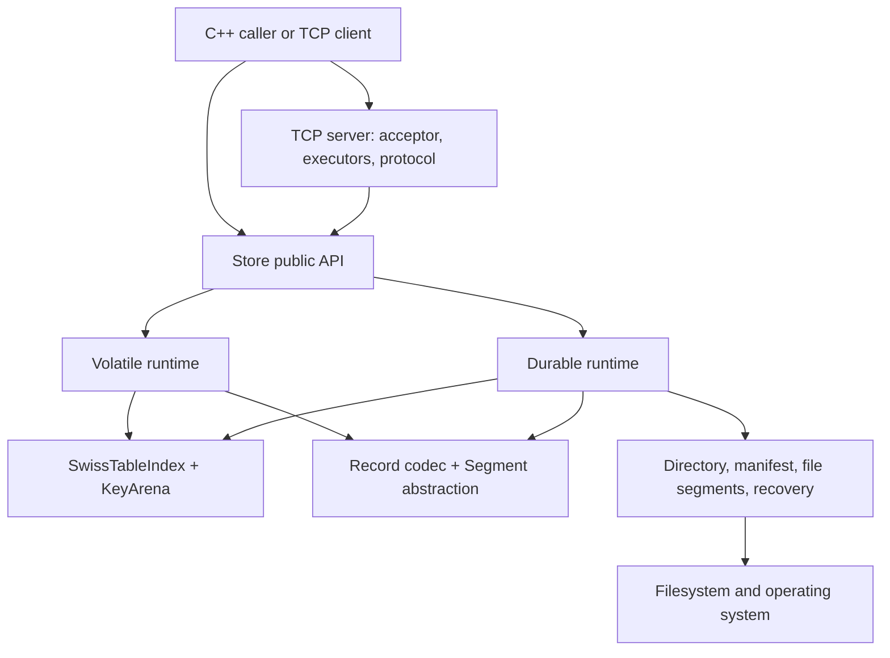
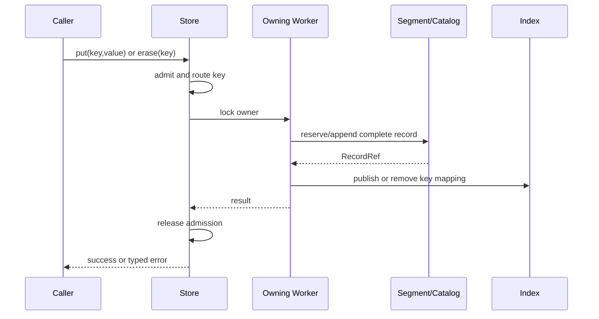

# GlyphaStore Architecture Specification

Status: normative for the current implementation
Applies to: repository format and API version `0.1.x`
Owner: project maintainers
Last reviewed: 2026-07-19

## 1. Purpose and scope

GlyphaStore is an embedded, binary-safe key/value storage engine with an optional TCP daemon. Its design optimizes predictable ownership, bounded synchronization, append-oriented persistence, and explicit crash-consistency boundaries.

The engine has two execution modes:

- **volatile mode**, whose records and segments live only in memory;
- **durable mode**, whose authoritative records live in versioned segment files and whose namespace is published by a manifest.

The TCP daemon currently exposes a volatile `Store`. It is an adapter over the public C++ API, not a separate storage engine.

GlyphaStore does not currently promise distributed consensus, replication, cross-key transactions, authentication, encryption in transit, a stable C ABI, or automatic on-disk format migration.

## 2. Architectural invariants

The following statements are requirements, not implementation suggestions:

1. A key has exactly one owning Worker for a fixed worker count and routing epoch.
2. A normal `get`, `put`, or `erase` executes under the owning Worker's synchronization domain.
3. No normal Store operation broadcasts to other Workers to discover a key.
4. The global catalog manages namespace and lifecycle metadata; it is not the normal per-key data path.
5. The Index is derived state. Record bytes in accepted segments, interpreted under the accepted manifest in durable mode, are authoritative.
6. Publication of a durable namespace must be atomic at the manifest boundary.
7. A record is not visible before its bytes are complete and its Index reference is published.
8. Shutdown closes admission before destroying any state reachable by admitted operations.
9. Unknown persistent format versions are rejected; they are never guessed or partially interpreted.
10. Network connection ownership is exclusive: at any instant exactly one executor may mutate a connection.

## 3. Layering

Dependencies point downward. Persistence and networking may use core types and codecs; neither may redefine Store semantics. The public `Store` facade selects one runtime at open time and preserves the same key-routing rule in both.

## 4. Planes

| Plane | Responsibilities | Must not become |
|---|---|---|
| Data | Route one key, access the owning Index, append/read one record | a global lookup or broadcast path |
| Control | Open/close, admission, configuration, routing epoch, namespace publication | a lock acquired for every read |
| Maintenance | Flush, verification, rotation, compaction, reclamation | an unsynchronized mutation path |
| Recovery | Validate directory, manifest, segments, crash tails, rebuild Indexes | a best-effort reader of ambiguous state |
| Network | Accept, parse, bind, dispatch, encode responses, apply backpressure | an alternate owner of storage state |

## 5. Volatile runtime

`WorkerPool` owns a fixed set of `Worker` objects. Each Worker owns:

- one `SwissTableIndex`;
- its active and sealed in-memory segments;
- one mutex that serializes that Worker's Store operations.

`GlobalSegmentManager` assigns monotonic segment identities and owns active and sealed segment objects. Retirement removes catalog ownership immediately; snapshots already returned retain independent shared ownership until their readers finish. Snapshot order is deterministic by Segment ID. Normal key lookup does not consult every segment or every Worker: the routing hash selects the Worker, and that Worker's Index identifies the record.

Volatile `flush()` is a successful no-op. Volatile `compact()` selects sparse sealed Segments from at most one Worker, copy-builds replacement Segments and a complete replacement Index under that Worker's lock, validates source liveness, atomically replaces the catalog authority, and retires the selected sources only when the replacement reduces the physical Segment count. Existing snapshots retain shared ownership of retired source bytes until their readers finish.

## 6. Durable runtime

The durable runtime contains one internal runtime Worker per routing Worker. Each owns a mutex, an Index, a current writable file segment, and bounded hot-record state. `DurableRuntimeCatalog` owns namespace-wide metadata and segment handles. `DataDirectory` validates and manages the engine-owned filesystem namespace. `Manifest` is the recovery authority for the published set of segments.

The durable path is file-backed; it does not require all segment contents to remain resident in RAM. A cold read pins the exact immutable Segment generation together with its `RecordRef` under the owning Worker and catalog locks, releases both locks for all file I/O and validation, and linearizes only when a final locked check still finds the same Index reference and generation pin. The hot-record cache is an optimization and never recovery authority.

The `DurableFlushCoordinator` supplies periodic and deadline-driven group commit. It invokes the flush callback without holding its internal condition-state mutex. Foreground `flush()` can wait for a numbered flush-all generation.

Durable compaction creates replacement segments, records recovery intent, publishes the next manifest generation, and retires superseded files according to the persistence specification. The public `Store::compact()` operation exists; automatic policy and exhaustive platform crash certification are separate concerns.

## 7. Routing and ownership

Routing v1 uses FNV-1a 64-bit over every byte of the complete key. For Worker count `N`, the owner
is `hash % N`. Protocol v2 standardizes the same formula and exposes wrong-owner responses together
with the routing epoch. Clients must associate cached routing decisions with both Worker count and
epoch.

Worker ownership is symbolic, not physical: a Worker owns a partition of key space, not a fixed set of key strings. Changing the worker count changes that partition and therefore requires an explicit rebalance/migration design. No online rebalance protocol is currently part of the product contract.

## 8. TCP runtime

The server uses one reactor/executor per Store Worker. Accepted connections begin on an executor, perform protocol initialization, and bind exactly once to a target Worker. If the target differs, the connection object is handed off once through a bounded queue; the socket itself remains the same operating-system object. After handoff, the destination executor exclusively owns the connection and executes Store requests for its Worker.

There is no per-request reactor-to-Worker forwarding mesh. Key ownership mismatch is reported as `wrong_owner`; it is not repaired by searching other Workers. This keeps the steady-state path Worker-affine and makes cross-thread traffic a connection-establishment cost.

The complete external contract is [Wire Protocol v2](wire-protocol-v2.md).

## 9. Main flows

### 9.1 Put or erase

In durable modes, the acknowledgement point additionally depends on the selected durability policy. Visibility and durable persistence are distinct concepts; see [Persistence v1](persistence-v1.md).

### 9.2 Durable open and recovery

Any ambiguity that can change the accepted namespace is fail-closed.

## 10. Lifecycle

`Store::open()` validates configuration before publishing a usable handle. An open Store progresses through open, closing, and closed states. `close()` is idempotent and returns a sticky result. It closes admission, requests required flushing, waits for already admitted operations, stops background coordination, and only then releases runtime state.

Operations admitted after closing begins fail with `unavailable`. `worker_count()` remains a metadata query and does not imply that the Store is open.

## 11. Extension rules

- A new persistent field requires format-version and compatibility analysis before code is merged.
- A new shared mutable object requires an owner and lock-order entry in the concurrency specification.
- A new network field requires canonical byte encoding, decoder behavior, limits, and a golden fixture.
- A performance optimization must preserve recovery authority, ownership, and linearization points.
- Roadmaps may describe future designs but must not override this specification.

## 12. Related specifications

- [Concurrency and Memory Model](concurrency-memory-model.md)
- [SwissTableIndex v1](index-v1.md)
- [Wire Protocol v2](wire-protocol-v2.md)
- [Persistence v1](persistence-v1.md)
- [C++ API Reference](../reference/cpp-api.md)
- [Glossary](../glossary.md)
