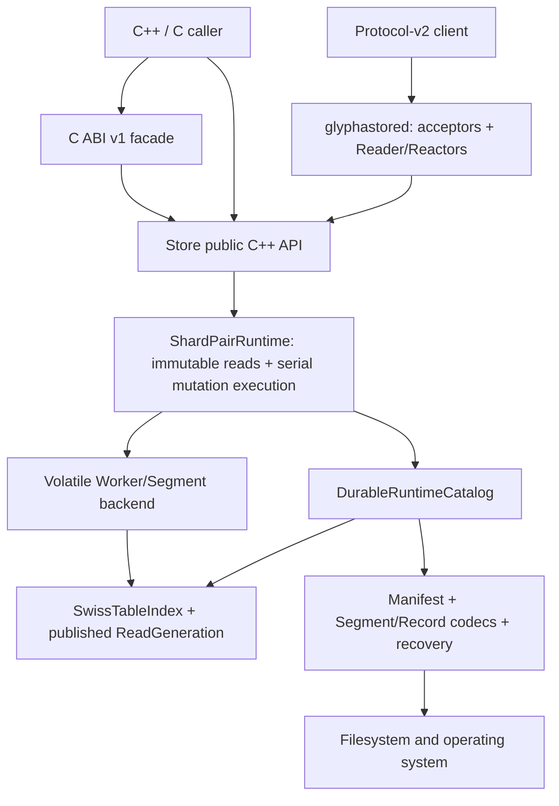
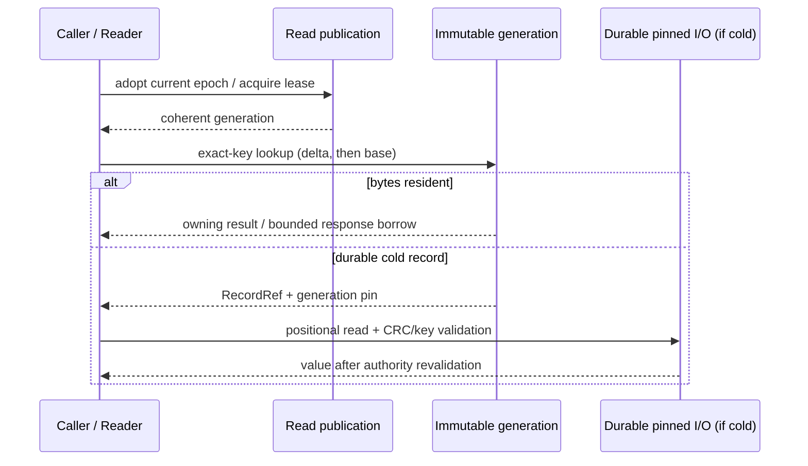
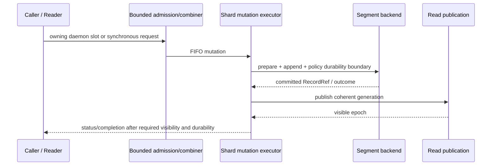

# GlyphaStore Architecture Specification

Status: normative for the current implementation
Applies to: repository format and API version `0.1.x`
Owner: project maintainers
Last reviewed: 2026-08-26

## 1. Purpose and scope

GlyphaStore is an embedded, binary-safe key/value storage engine with an optional TCP daemon. Its
design optimizes predictable ownership, bounded synchronization, append-oriented persistence, and
explicit crash-consistency boundaries.

Storage policy is selected independently from concurrency policy:

- `volatile_memory` keeps Records and Segments in memory;
- `durable_sync`, `durable_group`, and `durable_periodic` use persistence v1 files whose published
  namespace is authoritative through the Manifest;
- `paired` is the default embedded concurrency model and the only daemon data-plane model;
- `legacy_mutex` is an embedded-only, deprecated 0.1.x compatibility mode, removed in 0.2.

The daemon supports the same volatile and durable Store modes. It adds protocol v2, optional TLS
1.3/mTLS, capability and key-prefix authorization, quotas, lifecycle probes, and bounded connection
state; it is not a second storage engine.

The project implements a separately versioned C ABI v1, but the product remains an architectural
prototype. It does not promise distributed consensus, replication, cross-key transactions, hostile
public or adversarial multi-tenant deployment, C++ ABI stability, automatic on-disk migration, or
online resharding.

## 2. Architectural invariants

The following statements are requirements, not implementation suggestions:

1. A key has exactly one owning Worker/shard pair for a fixed persisted Worker count, routing
   algorithm, seed, and routing epoch.
2. Default paired mode has one immutable published read generation and exactly one mutation
   executor at a time per owner. Embedded callers may hold the execution token as a flat combiner;
   daemon asynchronous lanes use the pair's dedicated Writer thread.
3. Ordinary paired GET reads an immutable generation and does not acquire the mutable Index mutex,
   the global catalog, or a mutation/completion queue.
4. No normal Store operation broadcasts or searches other owners to discover a key.
5. A `RecordRef`, Segment handle, or file descriptor may cross a mutable lock boundary only with an
   exact generation pin and the documented revalidation/linearization protocol.
6. The Index and published generations are derived state. Accepted Record bytes, interpreted under
   the accepted Manifest in durable mode, are recovery authority.
7. Publication of a durable namespace is atomic at the Manifest boundary.
8. A Record is not visible before its bytes are complete and a coherent read generation is
   published. Visibility and durability remain separate acknowledgement dimensions.
9. Bounded lanes, buffers, catalogs, and resource policies reject or apply backpressure rather than
   grow from client-controlled input without limit.
10. Shutdown closes admission before destroying any state reachable by admitted operations and
    classifies every admitted mutation; no mutation may be silently abandoned.
11. Unknown or ambiguous persistent format state is rejected fail-closed; it is never guessed or
    partially interpreted.
12. Network connection ownership is exclusive: at any instant exactly one Reader/Reactor may mutate
    a connection and its buffers. A Writer never owns or writes a socket.

## 3. Layering

Dependencies point downward. The C ABI is a small synchronous facade, not an export of C++ object
layout. Persistence and networking may use core types and explicit codecs; neither may redefine
Store acknowledgement, visibility, routing, or recovery semantics.

## 4. Planes

| Plane | Responsibilities | Must not become |
|---|---|---|
| Data | Route one key, adopt one generation, append/read one Record | a global lookup, broadcast, or cross-owner fallback |
| Control | Open/close, admission, immutable configuration, routing identity, namespace publication | a control-plane lock or shared allocator on ordinary paired GET |
| Maintenance | Flush, verification, rotation, compaction, generation reclamation | an unsynchronized mutator or monolithic unbounded pause |
| Recovery | Validate directory, Manifest, Segments and crash tails; rebuild derived state | a best-effort reader of ambiguous state |
| Network | Accept, parse, bind, execute GET, submit mutation, encode/send, backpressure | an alternate owner of mutable storage or a socket-writing Writer |

## 5. Paired Store runtime

`ShardPairRuntime` is the default concurrency spine for both volatile and durable Stores. Each
persisted Worker id is one ownership shard with:

- a current immutable `ReadGeneration` used by readers;
- one mutable backend Index/active Segment owned by the current mutation executor;
- bounded synchronous combining state and, for daemon use, bounded asynchronous mutation payload
  slots and a dedicated Writer;
- release/acquire publication plus reader lease/epoch reclamation;
- per-shard admission, completion, batching, publication, and latency counters.

Embedded GET takes a counted read lease and returns an owning `OwnedValue`. A daemon Reader adopts
the generation once per event-loop turn and may use a bounded internal borrow only through response
encoding lifetime. No refcount increment/decrement occurs per daemon GET.

Embedded synchronous mutations contend for a per-shard execution token and may be flat-combined.
They do not require a permanent Writer thread when the asynchronous lane is disabled. The daemon
configures the asynchronous lane: its Reader copies request payload into bounded owned slots, and
the pair's Writer performs mutation and publication before returning a compact completion. This is
one concurrency model with two admission forms, not two storage authorities.

`StoreConcurrencyMode::legacy_mutex` retains the historical Worker-mutex path only as an explicit
embedded compatibility escape hatch. It is never selectable by `glyphastored`, and paired and
legacy mutators cannot operate on the same Store instance.

## 6. Volatile backend

The volatile backend owns a fixed `WorkerPool`. Each Worker owns a `SwissTableIndex`, an active
in-memory Segment, sealed Segments, and sequence/accounting state. In paired mode the Writer token
or dedicated Writer is the sole mutator; the Worker's mutex remains for maintenance and legacy mode,
not ordinary paired GET.

`GlobalSegmentManager` assigns Segment identities and owns active/sealed Segment objects. Published
generations and snapshots retain immutable ownership needed for safe retirement. Normal lookup does
not scan Segments or peer Workers: routing selects the owner and its generation resolves the exact
Record.

Volatile `flush()` is a successful no-op. Volatile compaction selects sparse sealed Segments from at
most one owner, copy-builds replacement state, validates liveness, publishes a coherent generation,
and retires sources only when physical Segment count decreases. Existing generation/snapshot leases
keep retired bytes alive until quiescence.

## 7. Durable backend

`DurableRuntimeCatalog` owns one runtime Worker per persisted owner, the data-directory lifetime
lock, namespace metadata, and exact immutable Segment-generation pins. `DataDirectory` validates the
engine-owned namespace; the Manifest is the authority for the published Segment set.

Paired durable mode disables the duplicate mutable hot-cache read authority: ordinary reads use the
published generation. A hot generation entry can return owned bytes directly. A cold entry carries
an exact `RecordRef` plus generation pin into positional I/O and CRC/full-key validation without
holding a Worker, catalog, or file-cache mutex. The result linearizes only after the documented
authority check still accepts the same generation/reference. No unpinned `RecordRef`, descriptor,
or Segment lifetime crosses the synchronization boundary.

The exclusive Writer may elide the durable Worker mutex on the `durable_sync` mutation hot path
when no flush coordinator shares mutable batch state. Group and periodic modes retain the required
Worker/coordinator synchronization. Maintenance uses explicit quiescence and catalog/publication
locks; it performs replacement file I/O outside those locks.

Durable compaction builds and validates replacement Segments without modifying a generation visible
to readers, records intent, atomically publishes the next Manifest, publishes the replacement read
generation, and retires sources only after safe quiescence. Physical power-loss behavior remains a
platform/filesystem/device evidence question; no row is currently E3/E4 certified.

## 8. Routing and ownership

The persisted `worker_count` is semantically the shard-pair count. Default routing is FNV-1a 64-bit
over every key byte. A configured or secure-profile-generated seed selects SipHash-2-4 routing
([ADR 0030](../adr/0030-keyed-worker-routing.md)); algorithm and seed are persisted in Manifest v1
and exposed by the extended INIT identity. For count `N`, the owner is `routing_hash % N`.

Clients cache routing only together with Worker count, routing epoch, algorithm, and seed. A key for
another bound owner receives `WRONG_OWNER`; it is never forwarded. Changing Worker count requires
the offline migration tool. Online resharding and routing-seed rotation are not part of 0.1.x.

## 9. TCP runtime

`glyphastored` runs one Reader/Reactor and one serial Writer per shard pair. Linux uses edge-triggered
`epoll`; macOS, FreeBSD, and OpenBSD use `kqueue`. Accepted sockets are non-blocking and
close-on-exec.

Connections start on a Reader, perform `INIT`, then bind exactly once with `BIND_WORKER`. If the
chosen owner differs, the complete socket/connection state moves once through a bounded handoff
queue. The destination Reader then has exclusive ownership. Normal owner-bound GET executes
directly against that Reader's adopted generation. PUT/ERASE traverse the bounded mutation lane and
return through the completion lane; the Writer never touches the connection.

Input/output buffers, handoff, mutation payload slots, cold-read work, and completions are bounded.
Queue exhaustion applies documented overload/backpressure; it never creates an unbounded backlog.
TLS/mTLS, authorization and quotas wrap the same protocol and do not change storage linearization.
The complete external contract is [Wire Protocol v2](wire-protocol-v2.md); the detailed runtime is
[server model](../architecture/server-model.md).

## 10. Main flows

### 10.1 GET (paired)

### 10.2 PUT or ERASE (paired)

The exact ordering among append, commit, visibility, durability and acknowledgement varies only by
the selected documented durability policy. It is normative in
[Persistence v1](persistence-v1.md), [mutation lifecycle](mutation-lifecycle.md), and the
[concurrency model](concurrency-memory-model.md).

### 10.3 Durable open and recovery

```mermaid
flowchart LR
    A["Acquire directory lock"] --> B["Validate engine namespace"]
    B --> C["Resolve bootstrap/compaction/rotation intent"]
    C --> D["Decode and validate Manifest"]
    D --> E["Open listed Segment generations"]
    E --> F["Validate committed extents and crash tails"]
    F --> G["Replay Records into per-owner Indexes"]
    G --> H["Build initial ReadGenerations and active writers"]
    H --> I["Admit operations"]
```

Any ambiguity that can change the accepted namespace is fail-closed.

## 11. Lifecycle

`Store::open()` validates configuration and completes durable recovery before publishing a usable
handle. `close()` atomically closes admission, drains operations already admitted, forces required
durability boundaries, stops maintenance and Writer/coordinator threads, waits for reader
quiescence, and then releases generations, runtime state, and the data-directory lock. The result is
sticky and idempotent.

The daemon first stops network admission, drains/classifies queued mutations and completions within
its configured deadline, sends decided responses where possible, then closes the Store and sockets.
A client disconnect never cancels Store work already executing; an undelivered mutation outcome is
indeterminate to that client.

## 12. Extension rules

- A persistent-byte or acknowledgement-order change requires an ADR, requirements, fixtures, and
  recovery/compatibility evidence.
- A new shared mutable object requires an owner, synchronization edge, reclamation rule, and lock
  order in the concurrency specification.
- A new network field/opcode requires canonical encoding, limits, malformed behavior, SDK fixtures,
  and compatibility analysis.
- A performance optimization must preserve generation pins, ownership, linearization, bounded
  memory, recovery authority, and shutdown classification.
- Roadmaps and benchmark notes may describe future designs or past evidence but never override this
  specification.

## 13. Related specifications

- [Concurrency and Memory Model](concurrency-memory-model.md)
- [Mutation lifecycle](mutation-lifecycle.md)
- [Connection drain state machine](connection-drain-state-machine.md)
- [Error taxonomy v1](error-taxonomy-v1.md)
- [SwissTableIndex v1](index-v1.md)
- [Wire Protocol v2](wire-protocol-v2.md)
- [Persistence v1](persistence-v1.md)
- [C ABI v1](c-abi-v1.md)
- [C++ API Reference](../reference/cpp-api.md)
- [Server model](../architecture/server-model.md)
- [Glossary](../glossary.md)
