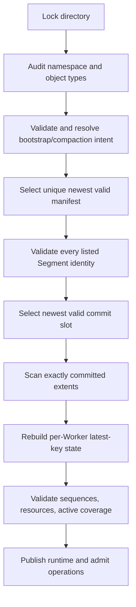

# GlyphaStore Persistence v1

Status: normative master specification
Applies to: persistent format family v1
Owner: persistence maintainers
Last reviewed: 2026-07-19

## 1. Scope and authority

This document defines the durable namespace, compatibility boundary, recovery authority, checksums, publication artifacts, and migration policy. Exact stable byte layouts for Records, Segment headers, commit slots, and manifests are incorporated by reference from:

- [Segment and Record format](../architecture/segment-format.md)
- [Manifest format](../architecture/manifest-format.md)

Ordering and failure semantics are defined by [Durability and recovery](../architecture/durability-recovery.md). If a roadmap or overview conflicts with these documents, this specification and the exact format documents win.

Persistent bytes are always encoded and decoded field by field. C++ object layout, native endianness, padding, and enum representation are never persistent format.

## 2. Filesystem namespace

A durable Store exclusively owns its data directory while open. Version 1 recognizes these engine-owned names:

| Name | Role |
|---|---|
| `manifest.glypha` | selected manifest candidate |
| `.manifest.glypha.tmp` | incomplete/new manifest publication candidate |
| `.glyphastore.lock` | exclusive process lock |
| `.glyphastore.bootstrap` | bootstrap intent encoded as Manifest v1 |
| `.glyphastore.bootstrap.tmp` | temporary bootstrap-intent publication |
| `.glyphastore.compaction` | durable compaction intent v1 |
| `.glyphastore.compaction.tmp` | temporary compaction-intent publication |
| `segment-<id>-<generation>.glypha` | published Segment file |
| `.segment-<id>-<generation>.tmp` | temporary Segment creation |

`<id>` is exactly 16 lowercase hexadecimal digits and `<generation>` exactly eight. A filename is not identity authority: the decoded Store ID, Segment ID, generation, owner, and versions must agree with the manifest and name.

Unknown names, symlinks, non-regular objects, duplicate aliases, or hard-link policy violations are handled fail-closed by the namespace policy. Temporary and orphan files may be quarantined only under an explicitly safe recovery rule; they are never silently adopted.

## 3. Format family

| Artifact | Version | Byte order | Stable layout |
|---|---:|---|---|
| Manifest | 1 | little-endian | 128-byte header + 32-byte entries |
| Segment header | 1 | little-endian | 4 KiB |
| Commit slot | 1 | little-endian | two 128-byte slots |
| Record | 1 | little-endian | 56-byte header + payload + zero padding |
| Bootstrap intent | 1 | little-endian | exactly a Manifest v1 byte sequence |
| Compaction intent | 1 | little-endian | 128-byte header + old/new Manifest bytes |

All lengths are validated with checked arithmetic before allocation. Trailing bytes are rejected unless the artifact's version explicitly defines them. Reserved bytes must be zero when written and are validated according to the exact codec contract.

## 4. CRC32C

All v1 checksums use CRC32C Castagnoli with:

- reflected polynomial `0x82F63B78`;
- initial accumulator `0xFFFFFFFF`;
- final bitwise complement;
- checksum field treated as zero during calculation;
- check value for ASCII `123456789`: `0xE3069283`.

Hardware instructions and the software table are interchangeable implementations of this exact function. Unaligned persistent input must be loaded without violating C++ alignment or aliasing rules.

Checksum success establishes accidental-corruption detection, not authenticity or trust against an attacker.

## 5. Manifest and recovery authority

The accepted Manifest v1 identifies the Store, routing configuration, exact Segment catalog, active Segment per Worker, and next identity counters. Only listed Segment identities contribute records to normal recovery.

Recovery selects only fully decoded, checksummed, invariant-valid publication candidates. The greatest valid manifest generation wins. Two different candidates with the same greatest generation are corruption. No mtime, directory enumeration order, or longest-file heuristic may break the tie.

Each listed Segment contributes records only through its newest valid commit slot. Bytes after `committed_end` are a crash tail and ignored. Invalid bytes before `committed_end` are corruption. A damaged newest slot may fall back to the other slot only when the damaged bytes do not encode a correctly checksummed unknown version.

## 6. Record semantics

Record v1 stores a complete key, value, sequence, key hash, expiration, opcode, value type, and flags. Public Store writers use canonical encodings:

- put: opcode `1`, value type `1` (`bytes`), provided key/value, expiration as requested, flags zero;
- erase: opcode `2`, value type `1`, provided key, empty value, expiration zero, flags zero;
- all alignment padding is zero and is included in the checksum.

Numeric value types `2` (integer), `3` (map), and `4` (lease) are allocated format values but have no public C++ Store semantics in version `0.1.x`. They must not be reinterpreted by convenience or native object layout. Flags have no publicly allocated v1 bits.

Within one Worker, mutation sequence is nonzero and strictly increasing. Recovery chooses the highest sequence for a full key; equal highest sequences are corruption. A tombstone or expired latest record suppresses older values.

## 7. Compaction intent v1

Compaction intent protects the transition from an old accepted manifest to its replacement. Its fixed header is 128 bytes:

| Offset | Size | Field | Rule |
|---:|---:|---|---|
| 0 | 4 | magic | bytes `47 4c 59 43` (`GLYC`) |
| 4 | 2 | version | `1` |
| 6 | 2 | header size | `128` |
| 8 | 4 | total size | `128 + old_size + next_size` |
| 12 | 4 | Worker ID | less than manifest Worker count |
| 16 | 16 | Store ID | nonzero; matches both manifests |
| 32 | 8 | old manifest generation | matches embedded old manifest |
| 40 | 8 | next manifest generation | matches embedded replacement |
| 48 | 4 | old manifest size | exact embedded byte count |
| 52 | 4 | next manifest size | exact embedded byte count |
| 56 | 4 | CRC32C | whole intent, this field zero |
| 60 | 68 | reserved | zero |
| 128 | `old_size` | old manifest | complete canonical Manifest v1 |
| … | `next_size` | next manifest | complete canonical Manifest v1 |

Both embedded manifests are decoded normally and must describe a legal, single-generation transition for the stated Worker. The total size is bounded by `128 + 2 * maximum_manifest_bytes` before allocation.

The magic bytes are intentionally readable but are not enough to identify a valid intent; version, size, checksum, Store identity, generations, and both manifests must all validate.

The canonical [`compaction_intent_v1.hex`](../../tests/fixtures/compaction_intent_v1.hex) fixture
captures a Worker 0 transition from Manifest generation 9 to 10. Three sealed source Segments become
one generation-incremented replacement while the active Segment remains unchanged. The independent
format generator verifies the outer checksum, both embedded Manifest checksums, header bindings,
immutable catalog metadata, and the canonical sealed-set replacement.

## 8. Bootstrap intent

`.glyphastore.bootstrap` contains exactly the canonical initial Manifest v1 bytes; it has no wrapper or separate codec. Its filename and directory state provide the intent context. Recovery may complete or clean bootstrap only through the documented creation state machine and only after validating that manifest and every referenced initial Segment.

## 9. Publication rules

The exact restart outcome for every bootstrap, mutation/flush, rotation, and compaction phase is
normative in the [recovery state-transition matrix v1](recovery-state-matrix-v1.md).

Stable files are never incrementally rewritten as a namespace transaction. Publication uses a temporary file in the same directory, complete write, required file synchronization, atomic rename, and required directory synchronization.

Whole-Worker compaction (ADR 0039) may build complete replacement Segment contents under recognized
private `.segment-<id>-<generation>.glypha.tmp` names while the old Manifest remains the sole
authority. Each staged file is synchronized, sealed and verified before the publication lease and
before the v1 compaction intent. After the exact intent is durable, all planned temporaries are
renamed to their canonical names and one directory synchronization orders that promotion before
the next Manifest. A crash before intent leaves only disposable temporaries; ordinary recovery
removes them only after a complete scan of the authoritative Manifest. A crash after intent is
resolved exclusively by the old/next authority rules in the recovery matrix.

Record bytes are ordered before the commit slot that authorizes them. Outside initial bootstrap,
Segment creation is durable before a Manifest can reference it. Bootstrap may publish its initial
Manifest first only while the identical durable bootstrap intent authorizes creation of every
missing exact pristine Segment. A Manifest that removes old Segments is durable before those
Segments may be deleted. Exact filesystem primitives and supported-platform assumptions are
defined in [Persistence filesystem](../architecture/persistence-filesystem.md).

## 10. Durability modes

- **volatile** has no persistent contract.
- **durable-sync** acknowledges only after the mutation's commit-slot synchronization completes.
- **durable-periodic** may acknowledge visible state before synchronization; explicit `flush()` and orderly `close()` force persistence.
- **durable-group** acknowledges the batch only after its commit slot is synchronized and its in-memory publication is complete.

These are acknowledgement contracts, not performance labels. A network disconnect after commit but before response creates an indeterminate client outcome.

## 11. Recovery state machine

Recovery is deterministic and independent of enumeration order. Resource preflight precedes large allocation or mutation. Any unresolved ambiguity, missing listed Segment, identity mismatch, unsupported required version, checksum failure within authority, sequence conflict, or arithmetic overflow prevents read-write open.

## 12. Compatibility and migration

Version `0.1.x` supports exact v1 reading and writing. It provides no automatic upgrade, downgrade, or cross-version rewrite path. Unknown required versions fail before mutation. Copying a directory to an older binary is unsupported unless that binary's compatibility matrix explicitly lists every artifact version present.

A future format change must include:

1. a compatibility-matrix entry;
2. new golden fixtures and corruption tests;
3. an ADR describing read/write compatibility;
4. an offline or online migration algorithm with interruption recovery;
5. rollback constraints and operator procedure;
6. evidence on every supported filesystem/platform pair.

Format version and software release version are independent. Version numbers are never inferred from filenames alone.

## 13. Security and operational limits

The data directory is trusted local storage, but malformed bytes are always treated as untrusted decoder input. Bounds, identity, checksums, and canonical representation are validated before use. CRC32C does not defend against malicious modification; deployments needing tamper evidence require a future authenticated format.

Power-loss durability depends on filesystem and device honoring the documented synchronization primitives. Process-kill tests are necessary but insufficient evidence for power-loss certification.

## 14. Required evidence

Before declaring persistence v1 stable, the repository must retain:

- golden fixtures for every stable artifact, including compaction intent;
- encode/decode and noncanonical-input tests;
- truncation, bit-flip, unknown-version, overflow, and allocation-bound tests;
- deterministic interrupted bootstrap, rotation, manifest, flush, and compaction tests;
- process-crash and supported-platform power-loss evidence;
- a published compatibility and migration statement.
