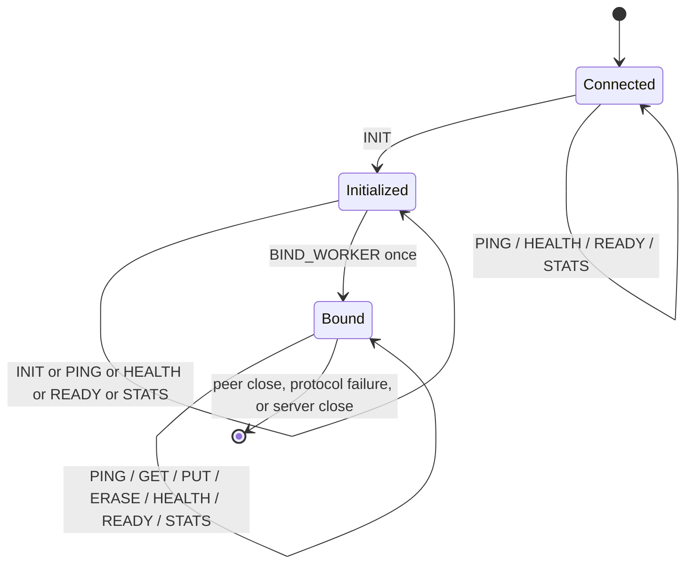

# GlyphaStore Wire Protocol v2

Status: normative for the current TCP server
Applies to: protocol version 2
Owner: networking maintainers
Last reviewed: 2026-07-23

## 1. Transport and byte order

The protocol runs over a reliable TCP byte stream, optionally wrapped in TLS 1.3 as an outer
transport ([ADR 0020](../adr/0020-tls-outer-transport.md),
[secure-profile reference](../security/secure-profile.md)). Every integer is unsigned and encoded
little-endian. Frames are length-prefixed; TCP packet boundaries have no semantic meaning.

The maximum protocol frame size is 2 MiB, including the header. The server's connection input and output buffering may impose an additional configured limit (4 MiB by default). A client must handle partial reads and writes.

There is no in-band STARTTLS, authentication opcode, compression, multiplexed stream identifier, or
protocol-level timeout field. Cleartext TCP remains the default listener mode. Confidentiality and
access control on reachable listeners use the opt-in secure profile: outer TLS 1.3, mTLS principals,
and coarse capabilities ([ADR 0020](../adr/0020-tls-outer-transport.md)–
[0022](../adr/0022-authorization-capabilities.md),
[secure-profile reference](../security/secure-profile.md)). Official clients impose local
connect/request deadlines and classify failures as specified in
[client semantics v1](client-semantics-v1.md). Outer TLS does not change frame layout; OpenBSD uses
LibreSSL.

## 2. Request frame

Every request has a 40-byte header followed by exactly `key_size` key bytes and `value_size` value bytes.

| Offset | Size | Type | Field |
|---:|---:|---|---|
| 0 | 4 | `u32` | `frame_size` |
| 4 | 2 | `u16` | `version`, exactly `2` |
| 6 | 1 | `u8` | `opcode` |
| 7 | 1 | `u8` | `flags` |
| 8 | 8 | `u64` | `request_id` |
| 16 | 4 | `u32` | `key_size` |
| 20 | 4 | `u32` | `value_size` |
| 24 | 8 | `u64` | `expire_at_ns` |
| 32 | 4 | `u32` | `target_worker` |
| 36 | 4 | `u32` | `reserved` |
| 40 | `key_size` | bytes | key |
| … | `value_size` | bytes | value |

`frame_size` must equal `40 + key_size + value_size` without overflow. Senders must set `flags` and
`reserved` to zero. Version 2 receivers reject nonzero values; no meaning may be inferred from them.

Keys and values are arbitrary bytes and need not be text or NUL-terminated.

## 3. Response frame

Every response has a 40-byte header followed by exactly `value_size` value bytes.

| Offset | Size | Type | Field |
|---:|---:|---|---|
| 0 | 4 | `u32` | `frame_size` |
| 4 | 2 | `u16` | `version`, exactly `2` |
| 6 | 2 | `u16` | `status` |
| 8 | 8 | `u64` | copied `request_id` |
| 16 | 4 | `u32` | `value_size` |
| 20 | 4 | `u32` | `owner_worker` |
| 24 | 4 | `u32` | `worker_count` |
| 28 | 4 | `u32` | `reserved`, zero |
| 32 | 8 | `u64` | `routing_epoch` |
| 40 | `value_size` | bytes | response value |

Unknown status codes must be treated as errors while preserving frame synchronization.

## 4. Opcodes

| Value | Name | Request fields | Successful response |
|---:|---|---|---|
| 1 | `INIT` | empty key/value; `expire_at_ns = 0`; `target_worker = kNoWorker` | value is ASCII `GlyphaStore/2`; reports worker metadata |
| 2 | `PING` | empty key; opaque value; `expire_at_ns = 0`; `target_worker = kNoWorker` | echoes value |
| 3 | `GET` | non-empty key; empty value; `expire_at_ns = 0`; `target_worker = kNoWorker` | stored value or `NOT_FOUND` |
| 4 | `PUT` | non-empty key; value; optional `expire_at_ns`; `target_worker = kNoWorker` | empty value |
| 5 | `ERASE` | non-empty key; empty value; `expire_at_ns = 0`; `target_worker = kNoWorker` | empty value or `NOT_FOUND` according to Store result |
| 6 | `BIND_WORKER` | empty key/value; `expire_at_ns = 0`; `target_worker` set to a real Worker id (not `kNoWorker`) | confirms worker metadata; may transfer connection ownership |
| 7 | `HEALTH` | empty key/value; `expire_at_ns = 0`; `target_worker = kNoWorker` | value is ASCII `GlyphaStore/live`; liveness probe |
| 8 | `READY` | empty key/value; `expire_at_ns = 0`; `target_worker = kNoWorker` | value is ASCII `GlyphaStore/ready`; readiness probe |
| 9 | `STATS` | empty key/value; `expire_at_ns = 0`; `target_worker = kNoWorker` | value is bounded ASCII `GlyphaStore/stats` report |

`HEALTH`, `READY`, and `STATS` are accepted before initialization and binding. They do not mutate
Store state. `HEALTH` returns `OK` while the daemon process is live (started and no executor failure
recorded). `READY` returns `OK` only while the server is ready to accept traffic: live, not shutting
down, Store admission open, durable catalog healthy, and maintenance is not in emergency or a sticky
faulted state. `STATS` returns `OK` with a versioned line-oriented report (`version`, `live`, `ready`,
connection counts, per-Worker durable mutation lane counters including fixed-bucket
`queue_wait_ns` / `service_ns` latency histograms (`count`, `sum`, cumulative `le_*`, approximate
p50/p99), batch counters, and maintenance snapshot fields, including durable rotation publication
wait, Segment seal/create, Manifest publication, aggregate execution, final Record commit timings,
and maintenance rate-window consumption) while live; the payload is
capped and may return `OVERLOADED` if it cannot fit the connection output budget. Failed
liveness/readiness/stats probes return `INTERNAL_ERROR` with an empty value. Under the secure
profile, `STATS` requires the `read` capability; it never returns TLS private-key material.

Unused fields must be canonical: empty payloads and zero/`kNoWorker` as listed above. Encoders and
decoders reject non-canonical opcode-specific fields with `INVALID_REQUEST` (or an equivalent encode
error on clients). Clients must not send ignored data.

## 5. Status codes

| Value | Name | Meaning |
|---:|---|---|
| 0 | `OK` | request completed |
| 1 | `INVALID_REQUEST` | invalid fields, sequence, or target |
| 2 | `UNSUPPORTED` | opcode or operation not supported |
| 3 | `INTERNAL_ERROR` | server could not complete request |
| 4 | `NOT_FOUND` | key is not currently visible |
| 5 | `OVERLOADED` | bounded resource or admission limit reached |
| 6 | `WRONG_OWNER` | bound Worker does not own the key; `owner_worker` is authoritative |
| 7 | `NOT_BOUND` | Store operation attempted before Worker binding |
| 8 | `PERMISSION_DENIED` | secure-profile authz denied the opcode for this principal |

The mapping from internal error categories to protocol status is many-to-one. Clients must not infer an internal `ErrorCode` that is not carried on the wire.

## 6. Session state

A conventional session is:



Current version-2 behavior is precise:

- `PING`, `HEALTH`, `READY`, and `STATS` are accepted before initialization and binding;
- repeated `INIT` is accepted and returns the same identification value;
- `BIND_WORKER` requires successful initialization, a valid target, and no prior bind;
- `GET`, `PUT`, and `ERASE` before binding return `NOT_BOUND`;
- binding is permanent for the connection;
- after binding, a key owned by another Worker returns `WRONG_OWNER`; the server does not forward that request.

Clients should send `INIT`, read worker metadata, choose a Worker, and send exactly one `BIND_WORKER` before Store traffic.

## 7. Routing metadata

Responses carry `worker_count` and `routing_epoch`. Protocol v2 routing uses FNV-1a 64-bit over the
complete key, starting at offset basis `14695981039346656037` and, for each byte in order, XORing
the byte then multiplying modulo 2^64 by `1099511628211`. The owner is:

```text
owner_worker = fnv1a64(key) % worker_count
```

A client that receives `WRONG_OWNER` should trust the response's `owner_worker`, refresh the current
Worker count/epoch, and choose or open an appropriately bound connection.

A client should maintain at least one connection per actively used Worker when it needs Worker-affine throughput. Changing worker count or epoch invalidates cached routing decisions. Online epoch transition and rebalance are not yet defined.

## 8. Pipelining and ordering

Clients may place multiple complete requests on one connection without waiting for each response. The server processes and emits responses in request order for that connection.

There is no cross-connection ordering guarantee and no transaction spanning requests.

### 8.1 `request_id` semantics

`request_id` is a client-chosen unsigned 64-bit correlation token. The server copies it verbatim onto the matching response and performs no other processing on it.

Normative rules:

1. **Correlation only.** `request_id` lets a pipelining client match each response to its request. It does not change server processing order, acknowledgement timing, or durability boundaries.
2. **No server deduplication.** The server maintains no duplicate-detection table, replay cache, or idempotency scope keyed by `request_id`, neither per connection nor globally. Clients must never assume that reusing an id suppresses duplicate mutation or yields a cached prior outcome.
3. **Duplicate ids on one connection.** Reusing the same `request_id` for different in-flight or subsequent requests on one connection is undefined for the client: responses still arrive in request order, but applications must not infer deduplication, safe retry, or commit proof from id reuse alone.
4. **Fresh ids after reconnect.** After any TCP reconnect, previously used `request_id` values carry no server memory. A client must allocate fresh ids for new attempts on the new session.
5. **No wire idempotency token.** Protocol v2 has no deduplication field. Application-level idempotency is out of band.

Official clients classify transport loss, automatic retries, and mutation outcomes per [client semantics v1](client-semantics-v1.md).

## 9. Expiration

`expire_at_ns` is meaningful only for `PUT`. Zero means no expiration. A nonzero value is an absolute Unix timestamp in nanoseconds. Expired records are not visible to `GET`; exact reclamation timing is not promised.

Clock synchronization is an operational responsibility. Version 2 has no server-time query.

## 10. Malformed input and connection closure

The server closes the connection without a response when it cannot safely decode frame boundaries, including an invalid header size, unsupported version at framing time, size overflow, or frame beyond the maximum. Once framing is trustworthy, semantic request errors may receive `INVALID_REQUEST` or `UNSUPPORTED`.

Failure to enqueue a one-time connection handoff, input/output buffer exhaustion, socket error, or peer EOF also closes the connection.

### 10.1 Reconnect and transport loss

When a connection closes for any reason, all session state for that TCP stream is lost on the server side. A client opening or reusing transport to the same daemon must treat the new stream as a fresh session.

Normative rules:

1. **Re-bootstrap required.** Before Store traffic (`GET`, `PUT`, `ERASE`), the client must send `INIT`, read worker metadata, and send exactly one `BIND_WORKER` on the new connection. Pipelined or bound state from a prior connection is not preserved.
2. **Routing metadata check.** On reconnect, official clients accept only the original `worker_count` and `routing_epoch` discovered at client construction. A mismatch makes the session unusable (`unavailable`); the application must construct a new client because protocol v2 defines no online rebalance.
3. **Indeterminate mutations.** If any request bytes of a `PUT` or `ERASE` were written before disconnect without a trustworthy definitive response, the mutation outcome is **indeterminate**: the server may or may not have applied it. Disconnect timing alone does not prove commit or rejection.
4. **No cancel on disconnect.** Admitted durable work is not cancelled because the client lost the connection; a mutation may commit after the client observes transport failure.
5. **No `request_id` carry-over.** Reconnect does not resume an earlier exchange. Retrying a logical mutation is a new request with a new `request_id`; the server does not deduplicate by id (§8.1).

A client must treat disconnect as an indeterminate transport outcome for mutations with bytes sent: it cannot know solely from the disconnect whether a mutation linearized. Official clients implement re-bootstrap, routing checks, and outcome classification per [client semantics v1](client-semantics-v1.md).

## 11. Backpressure

Input, output, and handoff queues are bounded. A client that does not read responses can eventually be disconnected. A client that sends faster than the bound executor can process may stop receiving read readiness or be disconnected at a configured hard bound. Unlimited buffering is never promised.

At most one durable cold `GET` is admitted per connection. Later frames on that connection remain
buffered and are not executed until the read completes, preserving the response order defined in
section 8. Disk-read executor or completion-capacity saturation returns `OVERLOADED` for the `GET`;
it never creates an unbounded queue. This does not prevent other connections bound to the same
Worker from making progress.

## 12. Compatibility rules

- Version 2 accepts only the exact version value `2`.
- Additive semantics for flags require a new written compatibility rule before use.
- Changing a field width, byte order, header length, opcode meaning, or response ordering requires a new protocol version.
- Encoders must emit canonical zero values for unused and reserved fields.
- Golden byte fixtures for every opcode and malformed-size boundary are required before declaring the protocol externally stable.

## 13. Minimal client algorithm

1. Connect over TCP.
2. Send `INIT`; verify version, status, and identification value.
3. Record `worker_count` and `routing_epoch`.
4. Send `BIND_WORKER` for a valid Worker.
5. Send framed requests and read framed responses in order.
6. On `WRONG_OWNER`, use a connection bound to `owner_worker`.
7. On transport loss, re-bootstrap with `INIT` and `BIND_WORKER` (§10.1). Treat mutations with bytes sent as indeterminate; never assume server `request_id` deduplication (§8.1). Apply application-specific reconciliation before retrying a logical mutation. Official clients classify outcomes and automatic retries per [client semantics v1](client-semantics-v1.md).
